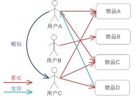
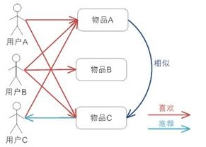

<p align="center">


</p>

| 分支名称                                                       | Spring Boot 版本 | JDK 版本 |
|--------------------------------------------------------------------|----------------|------| 
| [master](https://github.com/wayn111/waynboot-mall)                     | 3.0.6          | 17   |
| [springboot2.7](https://github.com/wayn111/waynboot-mall/tree/springboot-2.7) | 2.7.5          | 1.8  |     

---
# 简介
newbee-mall-pro项目是在newbee-mall项目的基础上改造而来, 使用mybatis-plus作为orm层框架，并添加了一系列高级功能以及代码优化，功能如下：

1. 商城首页 【为你推荐】 栏目添加协同过滤算法。按照UserCF基于用户的协同过滤、ItemCF基于物品的协同过滤。 实现了两种不同的推荐逻辑， 详情可见：[更新日志](#2023年4月08日更新日志)
2. 使用Redis作为缓存中间件，并引入RedisSearch，支持中文分词搜索。详情可见：[更新日志](#2022年3月27日更新日志)
3. 集成RabbitMQ，增加生产者、消费者常用配置
4. 使用Spring事件监听，完成异步下单，解耦下单流程
5. 集成Spring-Session-Redis，支持分布式集群部署
6. 秒杀专区：支持功能完备，生产可用的高级秒杀功能，详情可见：[更新日志](#2021年1月14日秒杀接口升级)
7. 优惠卷专区：支持优惠卷后台配置、用户注册赠卷、下单页面优惠卷使用等功能
8. 商城首页使用滑块验证码登录 详情可见：[更新日志](#2022年4月23日更新日志)
9. 支付时添加了支付宝沙箱支付
10. 集成Pace页面，添加网页进度条
11. 集成[mybatis-xmlreload](https://github.com/wayn111/mybatis-xmlreload-spring-boot-starter)，支持mybatis xml文件热加载
12. 支持多数据源：多数据源配置在Springboot2.7分支，通过jta和seata支持分布式事务
13. 本项目秉持原作者简单易用的原则，代码书写清晰，注释完整，便于新人理解，快速上手
14. [本项目源码](https://github.com/wayn111/newbee-mall-pro)
15. [在线地址](http://121.4.124.33/newbeemall)

> 如果有任何使用问题，欢迎提交Issue或加关注我公众号私信我告知，方便互相交流反馈～ 💘。最后，喜欢的话麻烦给我个star

关注公众号：waynblog，每周更新最新技术干货。回复关键字：
- **学习**：加群交流，群内问题都会一一解答。
- **演示账号**：获得线上商城管理后台演示账号。
- **开源项目**：获取博主自己写的三个开源项目，包含PC商城、H5商城、通用后台权限管理系统等。


---
- [开发部署](#开发部署)
- [在线截图](#在线截图)
- [更新内容](#更新日志)
- [参考资料](#参考资料)

---

# 代码结构
```
|-- ltd.newbee.mall
|   -- annotatino                   // 自定义注解
|   -- aspect                       // 切面逻辑
|   -- config                       // 全局配置，包括支付宝、缓存、数据库连接池、web配置等 
|   -- constant                     // 常量定义
|   -- controller                   
|       -- admin                    // 后台接口对应的控制器
|       -- mall                     // 前台接口对应的控制器
|   -- core                         
|       -- entity                   // entity类目录，每个entity都有对应的数据表
|       -- dao                      // mybatis框架对应的dao目录，通过dao与数据库进行交互
|       -- service                  // service类目录，对应项目中业务处理目录
|   -- enums                        // 枚举类存放
|   -- event                        // Spring事件发布订阅对应的自定义事件
|   -- exception                    // 包含自定义异常以及全局异常处理类
|   -- interceptor                  // Spring拦截器对应
|   -- listener                     // Spring事件发布订阅对应的自定义订阅
|   -- mq                     
|       -- config                   // mq配置  
|       -- reciver                  // mq消费者
|   -- recomment                    // 协同过滤算法实现
|   -- redis                        // 包含redis配置以及redis常用操作类
|   -- task                         // 项目定时任务配置
|   -- util                         // 项目帮助类
|   -- NewBeeMallApplication.java   // 项目启动类
```

# 本地开发

```
# 1. 克隆项目
git clone git@github.com:wayn111/newbee-mall-pro.git

# 2. 导入项目依赖
将newbee-mall-pro目录用idea打开，导入maven依赖

# 3. 安装Mysql8.0+、Redis3.0+(RediSearch2.0+)、Jdk17+、Maven3.5+
docker安装RediSearch
docker run -d --name redis-stack-server -p 6379:6379 redis/redis-stack-server:latest

# 4. 导入sql文件
在项目根目录下sql文件夹下，找到`newbee_mall_db_包含秒杀and优惠卷.sql`文件，新建mysql数据库newbee_mall_db，导入其中

# 5. 解压项目图片
将项目根目录下upload.zip文件加压缩到D盘upload文件夹中，eg:D:\\upload

# 6. 修改Mysql、Redis连接配置
修改`application-dev.yml`文件中数据连接配置相关信息

# 7. 启动项目
找到NewBeeMallApplication文件，右键`run AdminApplication`，启动项目

# 8. 访问商城管理后台
打开浏览器输入：http://localhost:84/newbeemall/admin/login，找到商品管理菜单，点击【同步RS】按钮，初始化RediSearch数据
账号：admin
密码：123456

# 9. 访问商城首页
打开浏览器输入：http://localhost:84/newbeemall
```

# 更新日志
## 2023年5月23日更新日志
newbee-mall-pro V2.4.3发布

更新内容：

秒杀专区集成RabbitMQ消息队列，秒杀成功后，下单接口会发送消息到MQ，再由消费者处理，提升下单能力。
- 生产者发送消息采用异步confirm模式
- 消费者消费消息时使用手动ack模式，并且添加了消息幂等性、消息异常最多处理5次的逻辑。


## 2023年4月08日更新日志
newbee-mall-pro V2.4.2发布

更新内容：

商城首页 **【为你推荐】** 栏目添加协同过滤算法。按照UserCF基于用户的协同过滤、ItemCF基于物品的协同过滤。 
实现了两种不同的推荐逻辑。
- **UserCF**：基于用户的协同过滤。当一个用户A需要个性化推荐的时候，我们可以先找到和他有相似兴趣的其他用户，然后把那些用户喜欢的，而用户A没有听说过的物品推荐给A。

   

  假设用户 A 喜欢物品 A、物品 C，用户 B 喜欢物品 B，用户 C 喜欢物品 A 、物品 C 和物品 D；从这些用户的历史喜好信息中，我们可以发现用户 A 和用户 C 的口味和偏好是比较类似的，同时用户 C 还喜欢物品 D，那么我们可以推断用户 A 可能也喜欢物品 D，因此可以将物品 D 推荐给用户 A。 具体代码在 `ltd.newbee.mall.recommend.core.UserCF` 中。
- **itemCF**：基于物品的协同过滤。预先根据所以用户的历史偏好数据计算物品之间的相似度，然后把与用户喜欢的物品相类似的物品推荐给用户。

   
  
   假如用户A喜欢物品A和物品C，用户B喜欢物品A、物品B和物品C，用户C喜欢物品A，从这些用户的历史喜好中可以认为物品A与物品C比较类似，喜欢物品A的都喜欢物品C，基于这个判断用户C可能也喜欢物品C，所以推荐系统将物品C推荐给用户C。 具体代码在 `ltd.newbee.mall.recommend.core.ItemCF` 中。

## 2023年3月27日更新日志
newbee-mall-pro V2.4.1发布

更新内容：
1. 集成[mybatis-xmlreload](https://github.com/wayn111/mybatis-xmlreload-spring-boot-starter)，支持xml文件热加载
2. 代码优化，通过阿里巴巴代码规范检测
3. 升级部分依赖至最新

## 2023年1月2日更新日志
newbee-mall-pro V2.4.0发布

更新内容：
1. Springboot版本升级至3.0.2
2. Mybatis plus升级至3.5.3.1支持Springboot3.0

## 2022年11月17日更新日志
newbee-mall-pro V2.3.0发布

更新内容：
1. Springboot版本升级至2.7.5，jdk升级至17
2. 使用switch表达式语法扩展，优化switch语句
3. 使用instanceof类型匹配语法简化，直接给对象赋值
4. 使用文本块优化现有lua脚本显示
5. 添加@Serial注解表示序列化字段和方法
6. 代码优化，删除无用导入
7. 升级项目依赖

bug修复：
1. 修复优惠券使用bug


## 2022年9月04日更新日志
newbee-mall-pro V2.2.0发布

更新内容：
1. 后台添加商品标签集成`select2`,支持商品标签`不存在即创建`
2. 添加Spring事件监听机制，解耦下单流程
3. 集成Pace，美化商城页面
4. 集成RedisSearch中文分词搜索
5. 集成`tianai-captcha`滑块验证码
6. 优化商城搜索页面逻辑
7. 升级项目依赖
8. 添加docker-compose部署

bug修复：
1. 修复商城搜索bug
2. 修复优惠券使用bug
3. 修复定时任务bug

## 2022年5月08日更新日志
商城RediSearch支持商品上下架搜索

## 2022年4月23日更新日志
商城登录页面添加滑块验证码登录,优化登录体验

1. 集成`tianai-captcha`滑块验证码,支持后端验证码校验


## 2022年4月12日更新日志

使用Spring事件监听机制，解耦下单流程，集成Pace美化商城进度条

1. 添加Spring事件监听机制，解耦下单流程，将下单流程拆解为订单校验、生成订单号、发送事件异步保存订单流程
2. 集成Pace页面，添加网页进度条，美化商城页面

## 2022年3月27日更新日志

商城添加RedisSearch搜索，支持中文分词搜索，推荐、新品、价格排序搜索

1. 添加RedisSearch测试用例
2. 后台添加RedisSearch同步按钮
3. 商城支持RedisSearch中文分词搜索

## 2022年3月21日更新日志

升级版本号至2.1.3，是一个功能完善版本

1. 支持分布式部署
2. 升级spring版本至2.6.4
3. 升级mybatis-plus至3.5.1
4. 添加Dockerfile文件支持容器部署

## 2021年5月30日更新日志

升级版本号至2.1.2，是一个代码优化版本

1. 秒杀专区购物车数量显示错误bug修复
2. 支付宝沙箱支付bug修复，显示沙箱账号
   
3. 将默认编辑器替换为[froala editor](https://froala.com/wysiwyg-editor/)
   ，[与tinyMCE比较](https://froala.com//blog/editor/froala-vs-tinymce/)
   
4. 添加站点演示模式，通过拦截器对不允许操作的后台路径进行错误提示处理
   
5. 升级pom文件部分依赖

## 2021年1月14日秒杀接口升级

本次升级主要在原有秒杀功能的基础上进行了完善，秒杀优化如下：

1. 秒杀页面静态化
2. 添加了秒杀接口限流，基于springAOP实现
3. 添加了秒杀接口防止重复提交，基于spring拦截器实现
4. 使用令牌桶算法过滤用户请求
5. 使用redis-set数据结构判断用户是否买过秒杀商品
6. 使用redis配合lua脚本进行原子自减，判断商品缓存库存是否大于0
7. 获取商品缓存，判断秒杀商品是否再有效期内
8. 执行存储过程（减库存 + 记录购买行为）
9. 使用redis-set数据结构记录购买过的用户
10. 返回用户秒杀成功VO
11. 下单后启用秒杀订单5分钟未支付超期任务
12. 订单5分钟内未支付则自动取消订单并回退库存

---

# 在线截图

| 商城首页                                          | 商品搜索                                         |
|------------------------------------------------------------------------------------------------------------------------------------|----------------------------------------------------------------------------------------------------------------------------------|
| 购物车                                                | 订单结算                                         |
| 订单列表                                           | 支付页面                                         |
| 分类管理    | 会员管理  |
| 优惠劵管理  | 商品管理  |
| 秒杀管理    | 订单管理  |

---

## 秒杀专区

秒杀专区为用户展示了后台设置的秒杀商品，在秒杀有效期内可以进行商品秒杀操作. 秒杀接口使用了接口限流、Redis以及储存过程提高秒杀操作的tps


------

## 优惠劵领取

优惠劵页面为用户展示了后台设置的可用优惠劵，在下单时可以使用优惠卷减少下单金额


------

## 商城15天交易额统计

商城15天交易额统计可以为商城运营人员展示商城近期总交易金额


---

# 参考资料

* 感谢 [newbee-mall](https://github.com/newbee-ltd/newbee-mall) 项目原作者十三提供的基础项目支持

* [秒杀架构模型设计](https://www.cnblogs.com/wyq178/p/11261711.html)

* [Java高并发秒杀API（慕课网）](https://github.com/liyifeng1994/seckill)

* [⭐⭐⭐⭐秒杀系统设计与实现.互联网工程师进阶与分析🙋🐓](https://github.com/qiurunze123/miaosha)

> 推荐一下本人的[后台权限管理系统](https://github.com/wayn111/crowd-admin) ,集成了消息通知，任务调度，代码生成等常用功能，易于上手，学习，使用二次开发
